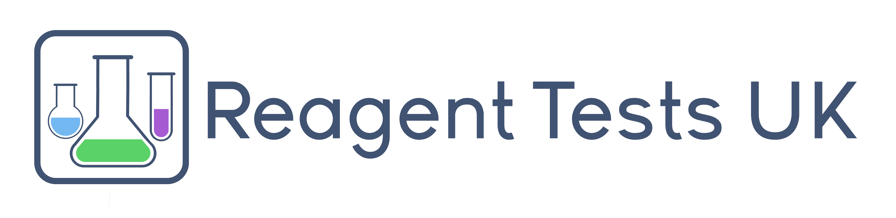

# Open source data analysis recreational drug use during COVID-19 outbreak

This respository contains the data from a survey conducted during April on recretional drug use during the pandemic.

Some are writing academic manuscripts with this dataset. If you are interested in writing one, please email me at ivan@drugsand.me first, in case there's someone else already working on what you are interested in. We'll find a way to collaborate (:

The survey was designed and developed by me (Ivan) with the support of my team at [Drugs and me](https://drugsand.me/)

## Introduction

The aims of this repository are:
- to provide the data from Drugs & Me's survey on recreational drug use during the COVID-19 crisis
- to analyse the data collaboratively
- to facilitate discussion and dissemination of the insights obtained

## Results
On the 7th of May, I gave a talk for the student Neuroscience society at University College London. I went through some preliminary analysis I managed to get done in a week after we closed the survey. Watch the full talk [here] (https://www.facebook.com/uclneurosoc/videos/929508020827421/)

On the 8th of June, Ivan published a short blog post about his journey before, during and after the survey. Read it [here] (https://drugsand.me/en/blog/covid-19-survey-results/).

## Acknowledgements

Special thanks to:

- [Reagent tests UK](https://www.reagent-tests.uk/)

